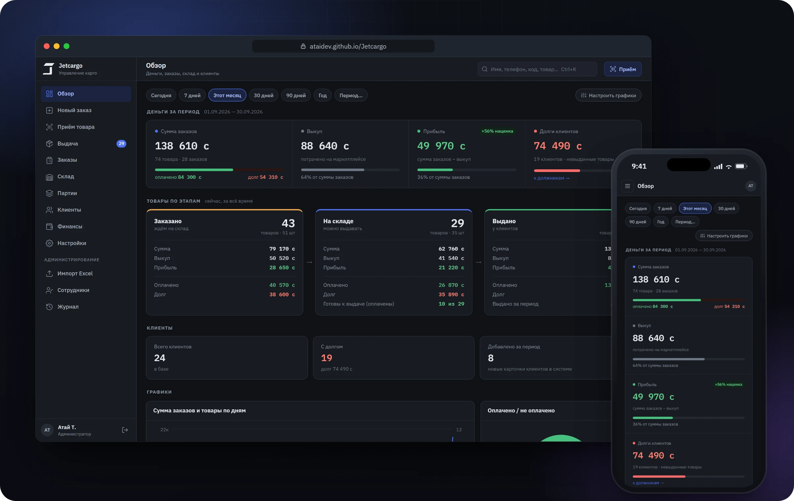
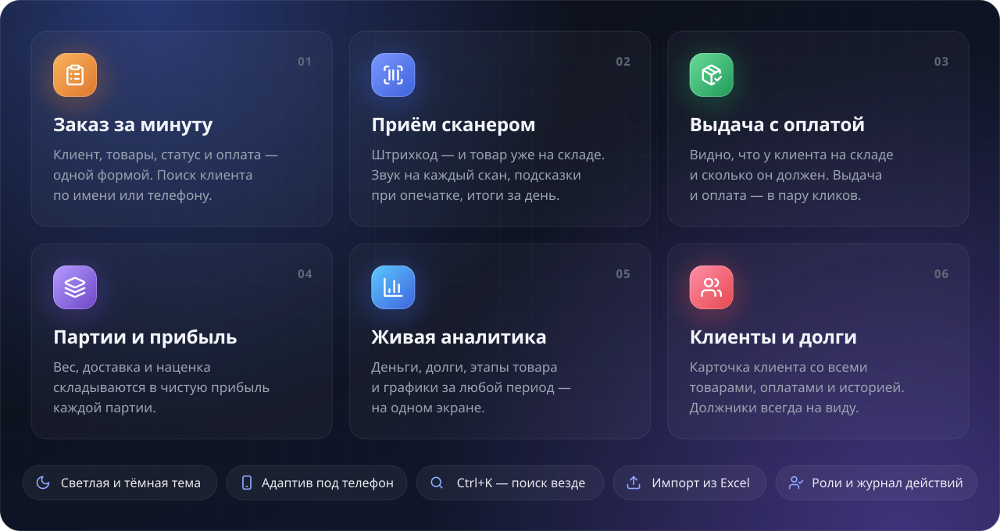
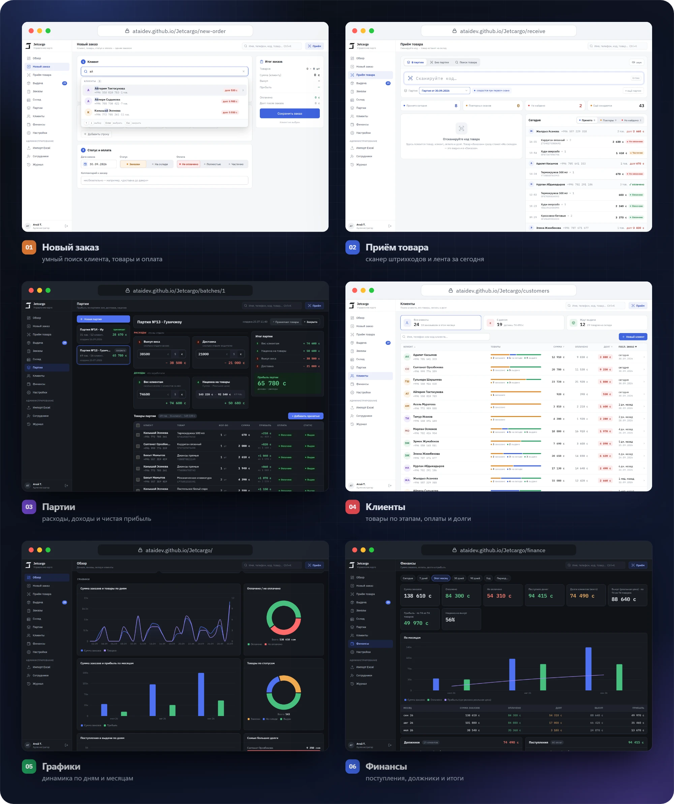
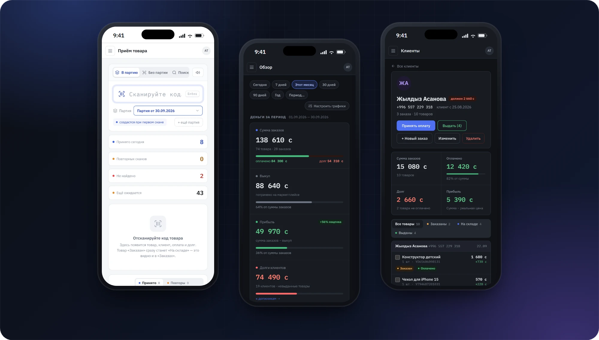
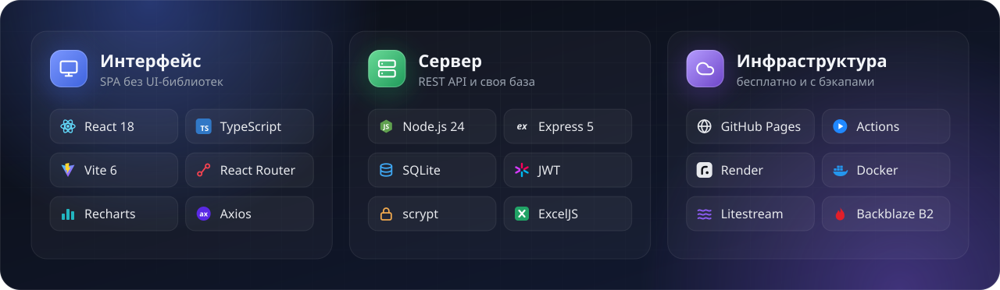

<div align="center">


<br><br>

<a href="https://ataidev.github.io/Jetcargo/"></a>
&nbsp;
<a href="docs/DEVELOPMENT.md"></a>

<br><br>



<br><br>

<p><b>Jetcargo</b> — рабочее место карго-компании.<br>
Заказы с маркетплейсов, приём посылок сканером, склад, выдача с оплатой, партии и прибыль —<br>
в одном быстром интерфейсе, на компьютере и на телефоне.</p>

</div>

<br>

<h2 align="center">Возможности</h2>
<p align="center">Всё, что нужно владельцу карго каждый день — без таблиц и тетрадей</p>



<br><br>

<h2 align="center">Экраны</h2>
<p align="center">Светлая и тёмная тема, продуманные мелочи и ни одного лишнего клика</p>



<br><br>



<p align="center"><sub>Вся панель работает с телефона — принимать и выдавать товар можно прямо на складе.<br>
На скриншотах демо-данные, все клиенты вымышлены.</sub></p>

<br>

<h2 align="center">Как это работает</h2>
<p align="center">Каждый товар проходит четыре шага, а деньги и долги считаются сами</p>



<br><br>

<h2 align="center">Стек</h2>
<p align="center">Лёгкий, быстрый и бесплатный в хостинге</p>



<br><br>

<h2 align="center">Быстрый старт</h2>

```bash
cp server/.env.example server/.env   # JWT_SECRET, ADMIN_LOGIN, ADMIN_PASSWORD
npm run dev                          # backend и админка одной командой
```

<p align="center">Панель откроется на <code>localhost:5173/admin</code> · нужен Node.js 24<br>
Облако, API, структура проекта и формулы — в <a href="docs/DEVELOPMENT.md"><b>документации для разработчиков</b></a></p>

<br>

<div align="center">
<sub>Сделано в Кыргызстане · © 2026 Jetcargo · приватный проект</sub>
</div>
